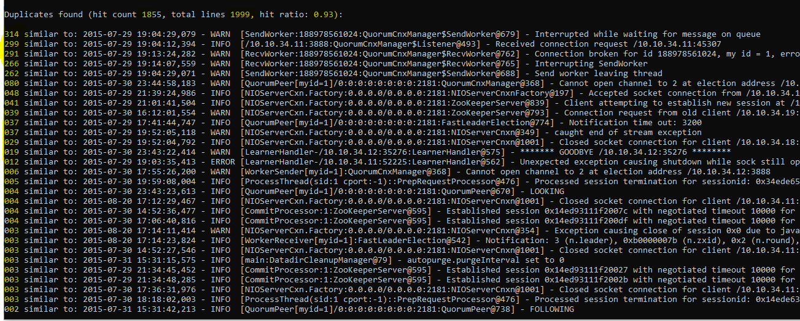

# LogAggregator

When I was looking through the stunning [presentation of SignalFabric](https://www.usenix.org/sites/default/files/conference/protected-files/opml19_slides_aghajanyan.pdf) I was wondering how does it group error messages having unique chunks inside - like codes or IPs or dates etc. Look into the picture:

Second aggregated error that has count of 554,378 starts with "Cannot log measure metric value 5993681..". I doubt that all 500K entries of actual logs contain the same value 5993681, most probably there are multiple numbers. But if the numbers are multiple, message are different and you cannot just use some sort of stored hashmap for aggregation or do some kind of direct comparison.

One thought is that they trained masked RNN like BERT transformer to learn on text with words missing and then for every new line them predict most probable words in place and reference the line to that "most probable" group.

I dont have much compute possiblities for myself so I decided to make similar solution using probabilistic data structures - MinHash and LSH.

I spend a weekend for the prototype to use 2K lines logs from [loghub](https://github.com/logpai/loghub) and it gives pretty solid results with hit ratio .92 - .98 on different log files. For example, zookeeper logs:

TODO I still dont hav emetrics for false positives. 

I will describe the algorithm in wiki section. What I like about it is that it takes O(1) to O(log(N)) time and space depending on desired false rate.

